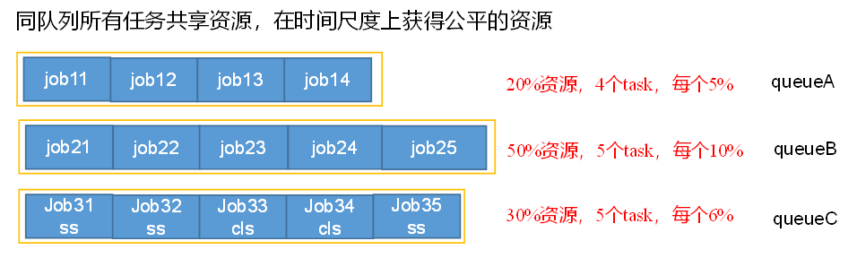

# 大数据面试大保健

## 一、Linux

### 1、常见高级命令

```shell
Top
Iotop
Ps -ef：查看进程
Df -h：查看磁盘使用情况
Netstat：查看端口号
Jmap -heap：查看某个进程内存
Tar：解压
rpm
```


## 二、shell

### 1、用过哪些工具？

```shell
awk
sed
sort
cut

python
```


### 2、写过哪些shell脚本

```shell
1）分发脚本

2）启停脚本
	#! /bin/bash
	
	case $1 in
	"start")
		for i in hadoop102 hadoop103 hadoop104
		do
			ssh $i "命令"
		done
	;;
	"stop")
		for i in hadoop102 hadoop103 hadoop104
		do
			ssh $i "命令"
		done
	;;
	esac
3）与mysql的导入导出
	mysql ->(datax)-> hdfs
	hdfs ->(datax)-> mysql

4）数仓层级内部的数据传递
	ods -> ads
```


### 3、''（单引号）与""（双引号）的区别

​	' '：不解析里面变量的值

​	""：解析里面变量的值

​	嵌套：	看谁在最外面


## 三、Hadoop

### 	1、入门

#### 		1.1 常用端口号

###### 2.x

```shell
50070：HDFS页面访问端口

8088：Yarn任务调度访问端口

19888：历史服务器

9000/8020：内部通讯访问端口
```


###### 3.x

```shell
9870(有改变)：HDFS页面访问端口

8088：Yarn任务调度访问端口

19888：历史服务器

9820/9000/8020(有改变)：内部通讯访问端口
```


#### 		1.2 常用配置

###### 2.x

```shell
core-site.xml:
hdfs-site.xml:
mapred-site.xml:
yarn-site.xml:
slaves:
```


###### 3.x

```shell
core-site.xml:
hdfs-site.xml:
mapred-site.xml:
yarn-site.xml:
workers(有改变):
```

##### 	

### 2、HDFS

#### 		2.1 hdfs 读写流程 笔试题（有没有朋友）


#### 		2.2 小文件的危害

##### 	**2.2.1 存储 ：**

​		主要影响NameNode的存储，因为无论小文件多小，都会占用150字节存储。

​		文件块的计算：文件块数量 = 128G（内存）[128G / 1024(m) / 1024(kb) / 1024(字节)]/ 150字节 = 9.1亿

##### 	**2.2.2 计算**

​		默认的切片规则，每个文件单独切片。（1字节文件 -> 开启1个maptask -> 开启1G内存）


#### 2.3 小文件怎么解决

##### 	**2.3.1har归档**

​		将多个小文件包裹在一起，统一进行发送（类似发快递）


​				

##### 	**2.3.2 CombineTextInputformat**

​		把所有文件放在一起统一切片


##### 	**2.3.3 JVM重用**

> ​	JVM重用是一把双刃剑，有小文件再开启。没有小文件，就会把一个任务执行非常长！


#### 2.4 副本数 3个


#### 2.5 块大小

​	**块大小取决于硬盘的读写速度，普通的机械硬盘（100m/s）选择128m，普通固态硬盘（300m/s）选择250m，高级固态硬盘（600m/s）选择512m。**

> ​	1.x	64m	
>
> ​	2.x	128m
>
> ​	3.x	128m
>
> ​	本地	32m
>
> ​	企业	128m 256m 512m

### 	3、MR

#### 3.1 shuffle 及其优化

map方法之后，reduce方法之前，中间这段混洗的过程，叫shuffle（最消耗内存）。

**优化1：**getpartition()方法里面能够自定义分区，避免数据倾斜。例如：相同的key有非常多的数据，可以给这个key加随机数（1,2,3,4），将key打散进入不同的reduce里面计算，计算完毕之后将随机数去掉，这样就可以解决数据倾斜。

**优化2：**将环形缓冲区的原本100m的内存提高或者80%百分比提高，因为这样就可以减少溢写到磁盘的文件数量。

**优化3：**在reduce归并内存充足的情况下，能够把默认一次归并10个溢写文件的数量提高到20个；或者reduce归并内存不足的时候，将默认一次归并的文件数量减少到5个。具体根据集群的资源情况进行上下调整。

**优化4：**进行combine，因为combine是在map阶段的，能够先按分区将数据提前操作好。(**前提：combine不能影响最终的业务逻辑**)

**优化5：**在写入磁盘前进行压缩，减少磁盘IO。

​	**map输出端：**使用snappy，因为快。因为数据进入map就切完片了，使用不用考虑切片。

​	**map输入端：**考虑数据量。数据量小就用snappy，就考虑快。数据量大用bzip2和lzop，考虑切片。

​	**reduce输出端：**看需求，如果给下一个mr的输入就和map输入端的选择一样。如果是永久保存，选择gzip，因为压缩的内容可以非常小，但是速度慢。

**优化6：**设置合理的内存

​	**Maptask**默认内存1G，能处理128M数据。在企业里如果处理1G数据，就需要8G内存（1028M/128M）。

​	**Reducetask**默认内存1G，能处理128M数据。如果数据量大，一般要给4-6G，也就是512M-768M数据量。

​	1CU = 1个**CPU**配4G内存


### 	4、Yarn

#### 4.1 Yarn的工作机制 

> ​	5.2 作业提交过程之 Yarn 


#### 4.2 调度器

##### 4.2.1 有几种

​	3种：FIFO调度器、容量调度器、公平调度器。


##### 4.2.2 默认是哪个调度器

​	**apache：**容量

​	**CDH：**公平


##### 4.2.3 各自调度器的特点

​	（**1）FIFO**：先进先出，单队列。在企业中很少使用，因为并行度为1，太低了。


​	**（2）容量（并行度低）：**支持多队列；优先保证先进入任务的执行；资源不够时，可以借。


​	**（3）公平（并行度高）：**支持多队列；每个任务公平享有队列资源；资源不够时，可以借。




##### 4.2.4 在企业中怎么选择

​	如果对并行度要求比较高，通常选择公平调度器。（中大型公司）

​	如果对并行度要求不高，通常选择容量调度器。（中小型公司）


##### 4.2.5 公平、容量默认几个队列

​	默认一个default队列


##### 4.2.6 创建多队列

​	**中小型公司：**hive、mr、spark、flink（怕公司来个菜鸟，递归死循环）

​	**中大型公司：**按照部门->按照业务线（登录-注册-订单-物流），好处：数据量大的时候（618、双11），可以**降级使用**，对不重要的业务线暂时关闭，发给重要的业务线。

### 5、调优

**HDFS、MR、Yarn调优文档：**

[HDFS、MR调优文档]: assets/06_尚硅谷大数据技术之Hadoop（生产调优手册）V3.3.docx
[Yarn调优文档]: assets/05_尚硅谷大数据技术之Hadoop（Yarn）V3.3.docx


### 6、过程图

#### 6.1 HDFS、Yarn、MapReduce三者之间的关系


**第1步：**客户端Client根据业务需求把任务提交给ResourceManager。

**第2步：**ResourceManager将在一台节点开启一个Container容器（相当于一个工作室）给ApplicationMaster，并且他们相互通讯。

**第3步：**ApplicationMaster向ResourceManager申请Container给MapTask，MapTask将对HDFS存储的数据进行搜查，提取出需要的文件夹，并进行操作和整理。

**第4步：**ApplicationMaster再向ResourceManager申请Container给ReduceTask，ReduceTask将所有MapTask搜查到的数据拉取过来。

**第5步：**ReduceTask将结果数据进行操作和整理，然后将数据发送到HDFS上进行存储。


#### 6.2 作业提交过程之 Yarn 


##### （1）作业提交

**第1步：**Client调用job.waitForCompletion方法，向整个集群提交MapReduce作业。

**第2步：**Client向RM申请一个application_id。

**第3步：**RM给Client返回该job资源的提交路径和作业id。

**第4步：**Client提交**jar包**（程序代码）、**切片信息**（决定未来开的maptask）**和xml配置文件**（程序配置）到指定的资源提交路径。

**第5步：**Client提交完资源后，向RM申请运行MrAppMaster。


##### （2）作业初始化

**第6步：**当RM收到Client的请求后，将该job添加到容量调度器中。

**第7步：**某一个空闲的NM领取到该Job。

**第8步：**该NM创建Container，并产生MRAppmaster。

**第9步：**下载Client提交的资源到本地。


##### （3）任务分配

**第10步：**MrAppMaster根据切片信息向RM申请运行指定个数的MapTask任务资源，并开启指定个数的Nodemanager。

**第11步：**RM将运行MapTask任务分配给NodeManager，NodeManager分别领取任务并创建Container。


##### （4）任务运行

**第12步：**MR向两个接收到任务的NodeManager发送程序启动脚本，这两个NodeManager分别启动MapTask，MapTask对数据分区排序。运行完之后，将所有的数据计算好，持久化到磁盘当中。

**第13步：**MrAppMaster等待所有MapTask运行完毕后，向RM申请容器，运行ReduceTask任务资源，并开启指定个数的Nodemanager。

**第14步：**ReduceTask向MapTask拉取相应分区的数据。

**第15步：**程序运行完毕后，MR会向RM申请注销自己。


##### （5）进度和状态更新

YARN中的任务将其进度和状态(包括counter)返回给应用管理器, 客户端每秒(通过mapreduce.client.progressmonitor.pollinterval设置)向应用管理器请求进度更新, 展示给用户。


##### （6）作业完成

除了向应用管理器请求作业进度外, 客户端每5秒都会通过调用waitForCompletion()来检查作业是否完成。时间间隔可以通过mapreduce.client.completion.pollinterval来设置。作业完成之后, 应用管理器和Container会清理工作状态。作业的信息会被作业历史服务器存储以备之后用户核查。


#### 6.3 作业提交过程之 HDFS & MapReduce 


##### 详细流程工作（一）

**第1步：**准备待处理文本/user/input，并且此文件大小为200m。

**第2步：**在客户端submit()前，获取待处理数据的信息，然后根据参数配置，形成一个任务分配的规划。也就是将文本以128m为单位进行切片，分成0-128和128-200两块。

**第3步：**提交信息：jar包、切片信息和配置文件。

**第4步：**根据切片信息，计算出MapTask的数量。

**第5步：**MapTask使用默认的TextInputFormat类的reader()方法进行数据的读取，并将数据以k,v的形式发给Mapper。

**第6步：**Mapper中用户可以通过setup(),map(),cleanup()方法进行逻辑运算，然后用context.write(k,v)进行提交。


##### 详细流程工作（二）

**第7步：**通过getpartition()方法标记数据，将数据进行分区，使得所有的数据在分区内操作处理。

**第8步：**通过outputCollector将数据入环形缓冲区。其中环形缓冲区的内存默认100m，一半存索引（kvmeta、kvindex），另外一半存储数据（<k,v>、bufindex）。当环形缓冲区到达80%时，存在数据的80%开始溢写，另外20%继续写入数据**（因为溢写的部分不能够写入数据）**，这样能够提高效率。

**第9步：**到达80%后，对同个分区的的数据进行快速排序（排序并不是对实实在在的数，而是**对key的索引按照字典顺序排序**）。

**第10步（可选，且可多次）：**将快速排序完毕的分区数据，以MapTask为单位进行combine操作，最后将排好序的数据归并。目的为了减少网络传输量。

**第11步：**将归并完毕的数据压缩。

**第12步：**将压缩好的数据溢写到磁盘中，其中需要分区且区内有序，准备ReduceTask的拉取。


##### 详细流程工作（三）

**第13步：**将Shuffle阶段处理好的分区，优先拉取到ReduceTask的内存当中。

**第14步：**如果内存的空间不足，将数据溢写到磁盘进行存储。

**第15步：**对每个map来的数据进行合并，同时按照key进行归并排序。

**第16步：**用GroupingComparator()将相同的key进行分组。

**第17步：**将分组完毕的数据发送到Reducer，进行自定义的reduce()操作。

**第18步：**ReduceTask使用默认的TextOutputFormat类的Write方法进行数据的写出，并将数据以k,v的形式保存到指定的路径。

### 7、源码

[源码文档]: assets/07_尚硅谷大数据技术之Hadoop（源码解析）V3.3.docx


## 四、Zookeeper

### 1、选举机制

​	半数机制


### 2、安装什么台数

​	奇数台


### 3、选举机制

​	10台服务器，安装多少台zk：3台

​	20台服务器，安装多少台zk：5台

​	50台服务器，安装多少台zk：7台

​	100台服务器，安装多少台zk：11台

​	200台服务器，安装多少台zk：11台


​	zk台数越多**好处**：可靠性高

​	**坏处**：效率低


### 4、常用命令

​	**ls：**用于查看某个路径下目录列表。

```shell
ls /runoob
```

​	**get：**用于获取节点数据和状态信息。

```shell
## path：代表路径。
## [watch]：对节点进行事件监听。

get /runoob watch
```

​	**create：**用于创建节点并赋值。

```shell
## [-s] [-e]：-s 和 -e 都是可选的，-s 代表顺序节点， -e 代表临时节点，注意其中 -s 和 -e 可以同时使用的，并且临时节点不能再创建子节点。
## path：指定要创建节点的路径，比如 /runoob。
## data：要在此节点存储的数据。
## acl：访问权限相关，默认是 world，相当于全世界都能访问。

create [-s] [-e] path data acl
```

​	**delete：**用于删除某节点。

```shell
## path：节点路径。
## [version]：可选项，版本号（同 set 命令）。

delete path [version]
```

​	**deleteall：**删除路径下所有内容。


### 5、zk底层算法

​	Paxos算法和ZAB协议


### 6、什么是CAP法则？Zookeeper符合了这个法则的哪两个？

​	**一致性（C:Consistency）：**多个副本之间是否能够保持数据一致的特性。

​	**可用性（A:Available）：**系统提供的服务必须一直处于可用的状态，对于用户的每一个操作请求总是能够在有限的时间内返回结果。

​	**分区容错性（P:Partition Tolerance）：**分布式系统在遇到任何网络分区故障的时候，仍然需要能够保证对外提供满足一致性和可用性的服务。

​	这三个基本需求，最多只能同时满足其中的**两项**，因为P是必须的，因此往往选择就在CP或者AP中。

​	**Zookeeper保证的是CP：因为在选举的过程中，不能保证可用性。**


### 7、第一次选举和非第一次选举什么区别？

#### 7.1 第一次选举

（1）服务器1启动，发起一次选举。服务器1投自己一票。此时服务器1票数一票，不够半数以上（3票），选举无法完成，服务器1状态保持为LOOKING；

（2）服务器2启动，再发起一次选举。服务器1和2分别投自己一票并交换投票信息：**此时服务器1发现服务器2的myid比自己目前投票推举的（服务器1）大，更改选票为推举服务器2。**此时服务器1票数0票，服务器2票数2票，没有半数以上结果，选举无法完成，服务器1,2,状态保持LOOKING；

（3）服务器3启动，发起一次选举。此时服务器1和2都会更改选票为服务器3。此时投票结果：服务器1为0票，服务器2为0票，服务器3为3票。此时服务器3的票数已经超过半数，服务器3当选Leader。服务器1,2更改状态为FOLLOWING，服务器3更改状态为LEADING。

（4）服务器4启动，发起一次选举。此时服务器1,2,3已经不是LOOKING状态，不会更改选票信息。交换选票信息结果：服务器3为3票，服务器4为1票。此时服务器4服从多数，更改选票信息为服务器3，并更改状态为FOLLOWING；

（5）服务器5启动，同4一样当小弟。


#### 7.2 非第一次选举

> **概念：**
>
> ​	SID：服务器ID，和myid一致。
>
> ​	ZXID：事务ID。ZXID是一个事务ID，用来标识一次服务器状态的变更。
>
> ​	Epoch：每个Leader任期的代号。

##### （1）当Zookeeper集群中出现以下两种情况之一时，就会开始进入Leader选举：

​	-- 服务器初始化启动

​	-- 服务器运行期间无法和Leader保持连接

##### （2）而当一台机器进入Leader选举流程时，当前集群也可能会处于以下两种状态：

​	**-- 集群中本来就已经存在Leader**

​		对于第一种已经存在Leader的情况，机器试图去选举Leader时，会被告知当前服务器的Leader信息，

​		对于该机器来说，仅仅需要和Leader机器建立连接，并进行状态同步即可。

​	**-- 集群中确实不存在Leader**

​		假设Zookeeper由5台服务器组成，SID分别为1、2、3、4、5，ZXID分别是8、8、8、7、7，并且此时SID为3的服务器是Leader。

​		某一时间，3和5服务器出现故障，因此开始进行Leader选举。

​		SID为1、2、4的机器投票情况（Epoch，ZXID，SID）：1,8,1；1,8,2；1,7,4。

​		**选举Leader规则：**①EPOCH大的直接胜出	②EPOCH相同，ZXID（事务ID）大的胜出	③ZXID相同，SID（服务器ID）大的胜出

## 五、数仓建模准备

### 1、ER模型

​	javaee程序员开发的，关于三范式。


### 2、维度建模

​	星型模型（事实表周围一级维度）：目的减少join操作。**（企业用的最多）**

​	雪花模型（事实表周围多级维度）

​	星座（多个事实表）


### 3、事实表

#### 3.1 什么样的表是事实表

​	有度量值的表，也就是可以累加的值（个数、件数、次数、金额）


#### 3.2 同步策略

##### 	（1）数据量大，同步时通常采用增量的方式。

##### 	（2）特殊情况（加购），这个需要全量进行同步。


#### 3.3 分类

##### 	（1）事务性事实表：

​			**找原子操作，点击（加购、下单、物流、退款）**

​			① 找业务过程

​			② 声明粒度

​			③ 确定维度

​			④ 确定事实

​			**不足**

​			① 统计连续型指标、库存类指标（解决方式：通过改变成周期型快照事实表）

​			② 多事实表的关联，大数据场景最怕join，特别是大表join大表。例子：统计从下单到物流的平均时长。（解决方案：采用累积型快照事实表


##### 		（2）周期型快照事实表：

​			① 找业务过程

​			② 声明粒度 （天）

​			③ 确定维度

​			④ 确定事实


##### 		（2）累积型快照事实表：

​			① 找业务过程（多条业务线）

​			② 声明粒度 

​			③ 确定维度

​			④ 确定事实（确定多个事实表）


### 4、维度表

#### 4.1 什么样的表是维度表

​	没有度量值的表，通常都是一些描述信息（身高，体重，年龄，性别）


#### 4.2 同步策略

​	（1）数据量小，同步时通常采用全量。

​	（2）特殊情况（用户表），数据量大并且缓慢变化，通常用增量进行同步。


#### 4.3 维度整合

​	目的向星型模型靠拢，也是为了减少join。

​	例如：商品表 + spu表 + 商品品类表 + 商品一级分类、二级分类、三级分类   ===》 商品维度表

​				省份表 + 地区表  ===》 地区维度表

​				活动信息表 + 活动规则表  ===》 活动维度表

#### 4.4 用户表需要对它进行拉链（缓慢变化维）

​	一周变化一次、一个月变化一次。不规律变化的表。


## 六、数仓建模（留存、转换率、GMV、复购、活跃）

### 1、数据调研（总时间50%）

总时间1个月：第一周平台搭建 - 第二周数据调研 - 第三周动手做 - 第四周调试bug

#### 1.1 熟悉公司业务

​	javaee后台的表如何产生。

​	847张表 FM 喜马拉雅（听书    加购 下单 支付 ）

​														播放相关

​														入住的频道

​	无用表不选择：图片、临时表、权限管理的表


#### 1.2 需要找业务人员详细沟通

​	进一步确认表与业务之间的关系


#### 1.3 和产品经理聊

​	指标：原子指标、派生指标、衍生指标

​	一般以派生指标为主：原子指标（业务过程 + 度量值 + 聚合逻辑） +  统计周期  +  统计粒度 + 业务限定

​	统一口径


### 2、明确数据域

#### 2.1 用户域

​	登录、注册

#### 2.2 流量域

​	页面、动作、故障、曝光、启动

#### 2.3 交易域

​	加购、下单、取消下单、支付、取消支付、物流、退货

#### 2.4 工具域

​	优惠券领取、优惠券使用（下单）、优惠券使用（支付）

#### 2.5 互动域

​	收藏、评论、点赞


### 3、构建业务矩阵

​	根据自身情况，如果表关系复杂就构建。

​	**构建方法：**纵坐标为事实表指标（登录、注册、动作...），横坐标为维度信息（用户、商品、活动....），然后中间有关系的打√即可。


### 4、建模

#### 4.1 ODS层

##### 	（1）保持数据原貌，不做任何修改。主要起到备份作用。

##### 	（2）采用分区表，防止后续全表扫描。

##### 	（3）采用压缩，减少磁盘空间。


#### 4.2 DIM层

##### 	（1）维度整合，为了减少join操作。

​			例如：商品表 + spu表 + 商品品类表 + 商品一级分类、二级分类、三级分类   ===》 商品维度表

​						省份表 + 地区表  ===》 地区维度表

​						活动信息表 + 活动规则表  ===》 活动维度表


##### 	（2）用户拉链表

​		目的：处理缓慢变化维

​		**实现方式：**

​			① 在用户表末尾加入开始时间和结束时间 。

​			② 第二天再再获取新增变化的数据 。

​			③ 两张表进行full join全外连。

​			④ 取出当前最新的放在一个分区（最新数据），覆盖的放在另外一个分区（历史数据）。


#### 4.3 DWD层

​	优先考虑采用**事务型事实表**	

##### 	（1）事务型事实表

​			找原子操作，点击（加购、下单、物流、退款）

​			① 找业务过程

​					选择感兴趣的，或者直接找产品经理。

​					无用表不选择：图片、临时表、权限管理的表

​			② 声明粒度

​					粒度：一行信息代表什么含义（一次下单、一周下单、一个月下单）

​					要求最小粒度：只要不做聚合操作即可。

​			③ 确定维度

​					未来统计的指标中需要（用户、商品、活动、优惠券、地区、时间）

​			④ 确定事实

​					确定事实表的度量值，也就是可以累加的值（个数、件数、次数、金额）

##### 	（2）周期型快照事实表

​			主要处理连续性指标（库存）。

##### 	（3）累积型快照事实表

​			主要针对多事实表关联。


### 5、指标体系建设

##### 	（1）ADS层

​			要统计哪些指标（一口气30个指标：日活、新增、留存、转换率、FMV、复购率）

##### 	（2）DWS层：指标拆分

​			**① 指标：原子指标、派生指标、衍生指标**

​				一般以派生指标为主：原子指标（业务过程 + 度量值 + 聚合逻辑） +  统计周期  +  统计粒度 + 业务限定

​				例子：统计每天各个省份购买手机的交易总额。

​							派生指标 = 交易总额（下单 + 金额 + sum） + 每天 + 省份 + 手机

​			**② 找公共的信息**

​				找公共的信息（业务过程 + 统计周期 + 统计粒度）

​			

### 6、报表可视化


## 七、每层做了那些事情

### 1、ODS层

​	（1）保持数据原貌，不做任何修改。主要起到备份作用。

​	（2）采用分区表，防止后续全表扫描。

​	（3）采用压缩，减少磁盘空间。


### 2、DIM层 & DWD层

​	除了维度整合、用户拉链、维度建模（事务型事实表、周期快照、累积快照）之外

##### 	（1）ETL数据清洗

​			清洗的手段：HQL、MR、Spark SQL、Python、Kettle

​			清洗的规则：


### 3、DWS层


### 4、ADS层  

 
