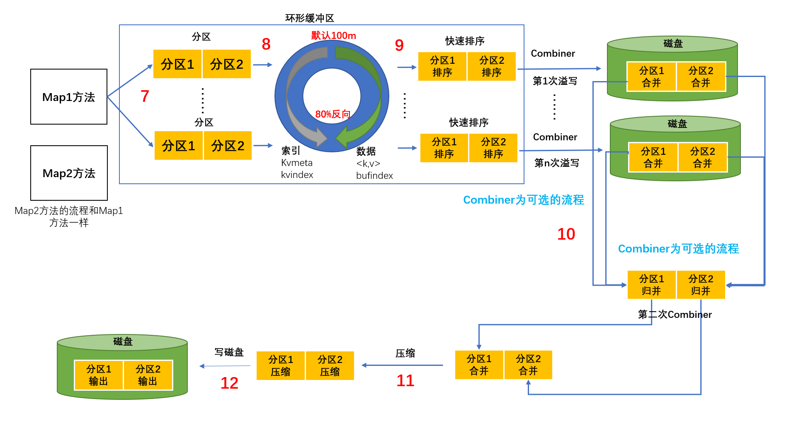

# 大数据面试大保健

## 一、Linux

### 1、常见高级命令

```shell
Top
Iotop
Ps -ef：查看进程
Df -h：查看磁盘使用情况
Netstat：查看端口号
Jmap -heap：查看某个进程内存
Tar：解压
rpm
```


## 二、shell

### 1、用过哪些工具？

```shell
awk
sed
sort
cut

python
```


### 2、写过哪些shell脚本

```shell
1）分发脚本

2）启停脚本
	#! /bin/bash
	
	case $1 in
	"start")
		for i in hadoop102 hadoop103 hadoop104
		do
			ssh $i "命令"
		done
	;;
	"stop")
		for i in hadoop102 hadoop103 hadoop104
		do
			ssh $i "命令"
		done
	;;
	esac
3）与mysql的导入导出
	mysql ->(datax)-> hdfs
	hdfs ->(datax)-> mysql

4）数仓层级内部的数据传递
	ods -> ads
```


### 3、''（单引号）与""（双引号）的区别

​	' '：不解析里面变量的值

​	""：解析里面变量的值

​	嵌套：	看谁在最外面


## 三、Hadoop

### 	1、入门

#### 		1.1 常用端口号

###### 2.x

```shell
50070：HDFS页面访问端口

8088：Yarn任务调度访问端口

19888：历史服务器

9000/8020：内部通讯访问端口
```


###### 3.x

```shell
9870(有改变)：HDFS页面访问端口

8088：Yarn任务调度访问端口

19888：历史服务器

9820/9000/8020(有改变)：内部通讯访问端口
```


#### 		1.2 常用配置

###### 2.x

```shell
core-site.xml:
hdfs-site.xml:
mapred-site.xml:
yarn-site.xml:
slaves:
```


###### 3.x

```shell
core-site.xml:
hdfs-site.xml:
mapred-site.xml:
yarn-site.xml:
workers(有改变):
```

##### 	

### 2、HDFS

#### 		2.1 hdfs 读写流程 笔试题（有没有朋友）


#### 		2.2 小文件的危害

##### 	**2.2.1 存储 ：**

​		主要影响NameNode的存储，因为无论小文件多小，都会占用150字节存储。

​		文件块的计算：文件块数量 = 128G（内存）[128G / 1024(m) / 1024(kb) / 1024(字节)]/ 150字节 = 9.1亿

##### 	**2.2.2 计算**

​		默认的切片规则，每个文件单独切片。（1字节文件 -> 开启1个maptask -> 开启1G内存）


#### 2.3 小文件怎么解决

##### 	**2.3.1har归档**

​		将多个小文件包裹在一起，统一进行发送（类似发快递）


​				

##### 	**2.3.2 CombineTextInputformat**

​		把所有文件放在一起统一切片


##### 	**2.3.3 JVM重用**

> ​	JVM重用是一把双刃剑，有小文件再开启。没有小文件，就会把一个任务执行非常长！


#### 2.4 副本数 3个


#### 2.5 块大小

​	**块大小取决于硬盘的读写速度，普通的机械硬盘（100m/s）选择128m，普通固态硬盘（300m/s）选择250m，高级固态硬盘（600m/s）选择512m。**

> ​	1.x	64m	
>
> ​	2.x	128m
>
> ​	3.x	128m
>
> ​	本地	32m
>
> ​	企业	128m 256m 512m

### 	3、MR

#### 3.1 shuffle 及其优化

map之后，reduce方法之前，混洗的过程，叫shuffle（最消耗内存）。


### 	4、Yarn

### 5、过程图

#### 5.1 HDFS、Yarn、MapReduce三者之间的关系


第1步：客户端Client根据业务需求把任务提交给ResourceManager。

第2步：ResourceManager将在一台节点开启一个Container容器（相当于一个工作室）给ApplicationMaster，并且他们相互通讯。

第3步：ApplicationMaster向ResourceManager申请Container给MapTask，MapTask将对HDFS存储的数据进行搜查，提取出需要的文件夹，并进行操作和整理。

第4步：ApplicationMaster再向ResourceManager申请Container给ReduceTask，ReduceTask将所有MapTask搜查到的数据拉取过来。

第5步：ReduceTask将结果数据进行操作和整理，然后将数据发送到HDFS上进行存储。


#### 5.2 作业提交过程之 Yarn 


##### （1）作业提交

第1步：Client调用job.waitForCompletion方法，向整个集群提交MapReduce作业。

第2步：Client向RM申请一个作业id。

第3步：RM给Client返回该job资源的提交路径和作业id。

第4步：Client提交jar包、切片信息和配置文件到指定的资源提交路径。

第5步：Client提交完资源后，向RM申请运行MrAppMaster。

##### （2）作业初始化

第6步：当RM收到Client的请求后，将该job添加到容量调度器中。

第7步：某一个空闲的NM领取到该Job。

第8步：该NM创建Container，并产生MRAppmaster。

第9步：下载Client提交的资源到本地。

##### （3）任务分配

第10步：MrAppMaster向RM申请运行多个MapTask任务资源。

第11步：RM将运行MapTask任务分配给另外两个NodeManager，另两个NodeManager分别领取任务并创建容器。

##### （4）任务运行

第12步：MR向两个接收到任务的NodeManager发送程序启动脚本，这两个NodeManager分别启动MapTask，MapTask对数据分区排序。

第13步：MrAppMaster等待所有MapTask运行完毕后，向RM申请容器，运行ReduceTask。

第14步：ReduceTask向MapTask获取相应分区的数据。

第15步：程序运行完毕后，MR会向RM申请注销自己。

##### （5）进度和状态更新

YARN中的任务将其进度和状态(包括counter)返回给应用管理器, 客户端每秒(通过mapreduce.client.progressmonitor.pollinterval设置)向应用管理器请求进度更新, 展示给用户。

##### （6）作业完成

除了向应用管理器请求作业进度外, 客户端每5秒都会通过调用waitForCompletion()来检查作业是否完成。时间间隔可以通过mapreduce.client.completion.pollinterval来设置。作业完成之后, 应用管理器和Container会清理工作状态。作业的信息会被作业历史服务器存储以备之后用户核查。


#### 5.3 作业提交过程之 HDFS & MapReduce 


##### 详细流程工作（一）

第一步：准备待处理文本/user/input，并且此文件大小为200m。

第二步：在客户端submit()前，获取待处理数据的信息，然后根据参数配置，形成一个任务分配的规划。也就是将文本以128m为单位进行切片，分成0-128和128-200两块。

第三步：提交信息：jar包、切片信息和配置文件。

第四步：根据切片信息，计算出MapTask的数量。

第五步：MapTask使用默认的TextInputFormat类的reader()方法进行数据的读取，并将数据以k,v的形式发给Mapper。

第六步：Mapper中用户可以通过setup(),map(),cleanup()方法进行逻辑运算，然后用context.write(k,v)进行提交。



##### 详细流程工作（二）

第七步：通过outputCollector将提交的数据**先标记分区**，然后再写入环形缓冲区。其中环形缓冲区的内存默认100m，一半存索引（kvmeta、kvindex），另外一半存储数据（<k,v>、bufindex）。当环形缓冲区到达80%时，存在数据的80%开始溢写，另外20%继续写入数据，这样能够提高效率。

第八步：到达80%后，在内存中将数据进行分区，然后对同个分区的的数据进行快速排序（排序并不是对实实在在的数，而是**对key的索引按照字典顺序排序**）。

第九步（可选，且可多次）：将排序好的分区数据，以MapTask为单位进行combine操作，最后将数据归并。目的为了减少网络传输量。

第十步：将归并完毕的数据压缩。

第十一步：将压缩好的数据溢写到磁盘中，其中需要分区且区内有序，准备ReduceTask的拉取。


##### 详细流程工作（三）

第十二步：将Shuffle阶段处理好的分区，优先存储再ReduceTask的内存当中。

第十三步：如果内存的空间不足，将数据溢写到磁盘进行。

第十四步：对每个map来的数据进行归并排序。

第十五步：按照相同的key进行分组。

第十七步：ReduceTask使用默认的TextOutputFormat类的Write方法进行数据的写出，并将数据以k,v的形式保存到指定的路径。


